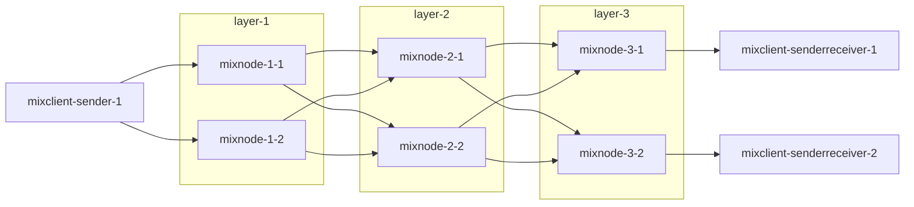

# Mixnet (deprecated)

## Components

- `node`: A mixnode implementation that will be assigned to one of the mixnet layers and will be responsible for receiving packets and forwarding them to the next mixnet layer.
- `client`: A mixclient implementation
    - which splits a message into multiple Sphinx packets, constructs mix routes for them, and sends the packets to the first mixnode in each route.
    - which receives Sphinx packets from a mixnode and reconstructs a message.

## Recommended Architecture

The mix `node` component can be integrated into a separate application, for example, so that it can be run independently with mixclients for better reliability or privacy.

The mix `client` component is also designed to be integrated into any application that wants to send/receive packets to/from the mixnet.
The `client` can be configured with one of modes described [below](#mixclient-modes).

## Mixclient Modes

- `Sender`: A mixclient only sends Sphinx packets to mixnodes, but doesn't receive any packets from mixnodes.
- `SenderReceiver`: A mixclient not only sends Sphinx packets to mixnodes, but also receive packets from mixnodes.
    - Due to the design of mixnet, mixclients always receive packets from mixnodes in the last mixnet layer.
    - Currently, only 1:1 mapping is supported. In other words, multiple mixclients cannot listen from the same mixnode. It also means that it is recommended that a single node operator runs both a mixnode and a mixclient.
