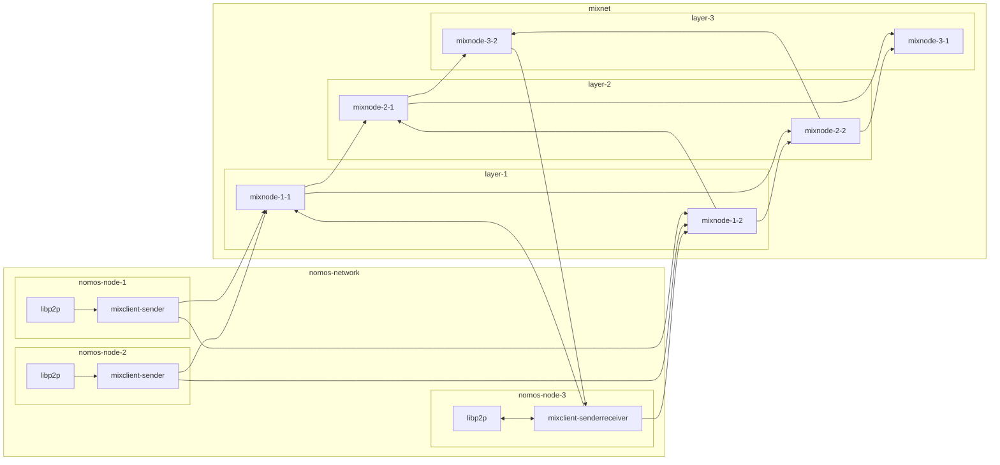

# Nomos Node

Nomos blockchain node 

## Network service

Nomos node can be configured with one of the following network backends:
- [libp2p](../../nomos-services/backends/libp2p.rs)

### Mixclient integration

The [mixclient](../../mixnet/client/) is currently integrated as a part of the libp2p network backend.
To run a Nomos node with the libp2p network backend, the `mixnet_client` and `mixnet_delay` fields in the [`config.yaml`](./config.yaml) must be specified, so the Nomos node can send/receive packets to/from mixnodes.

For more detials about the mixnode/mixclient architecture, see the [mixnet documentation](../../mixnet/README.md).

#### Sender mode

If you are a node operator who wants to run only a Nomos node (not a mixnode),
you can configure the mixclient as the `Sender` mode (like `nomos-node-1` or `nomos-node-2` above).
Then, the Nomos node sends messages to the mixnet instead of broadcasting them directly through libp2p gossipsub.

The mixclient in the `Sender` mode will split a message into multiple Sphinx packets by constructing mix routes based on the mixnet topology configured, and sends packets to the mixnode.

#### SenderReceiver mode

If you are a node operator who runs both a Nomos node and a mixnode,
you can configure the mixclient as the `SenderReceiver` mode by specifying the client listen address of your mixnode (like `nomos-node-3` and `mixnode-3-2` above).

The Nomos node with the mixclient in the `SenderRecevier` mode will behave essentially the same as the one in the `Sender` mode.
In addition, the node will receive packets from the connected mixnode, reconstruct a message, and broadcast it through libp2p gossipsub, if the connected mixnode is part of the last mixnet layer.
In other words, at least one Nomos node in the entire network must have a mixclient in the `SenderReceiver` mode, so that reconstructed messages can be broadcasted to all other Nomos nodes.

